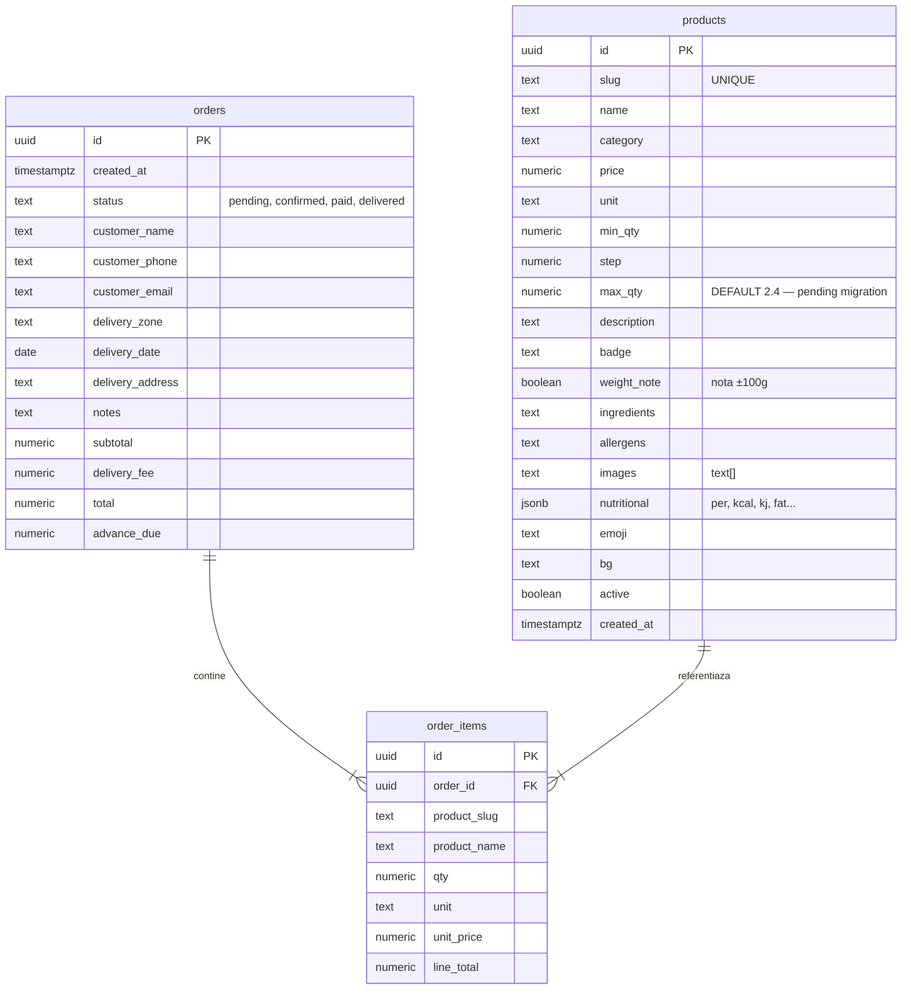
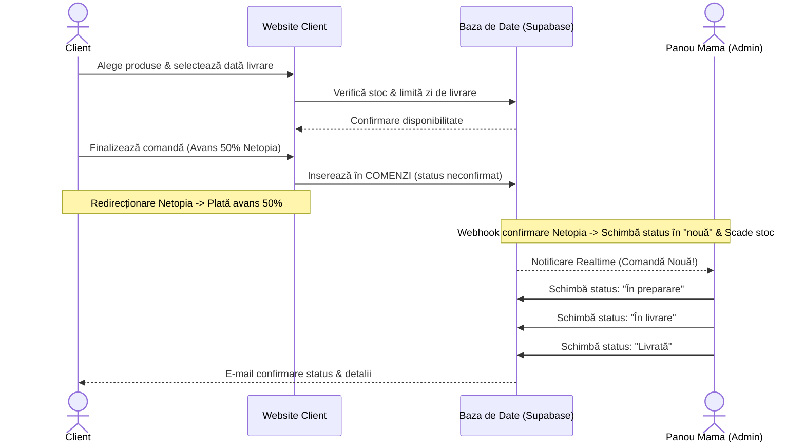

# 📐 Arhitectura Sistemului: BioCake

> [!abstract] Concept Tehnologic
> Pentru a păstra simplitatea, viteza de încărcare excelentă (vitală pentru conversia mobilă) și a asigura un cost de mentenanță zero, propunem o arhitectură bazată pe un **Frontend static modern** (Vite + Vanilla JS + CSS premium) integrat cu **Supabase** ca Backend-as-a-Service (BaaS). Acest lucru oferă o bază de date în timp real (PostgreSQL), autentificare securizată pentru administrator și gestionare de fișiere fără a fi nevoie de un server VPS custom.

---

## 1. Stiva Tehnologică (Stack)

| Strat | Tehnologie | Rationale |
| :--- | :--- | :--- |
| **Frontend** | Vite + Javascript (ES6+) | Construcție ultra-rapidă, fără overhead de framework greu. Încarcare instantă. |
| **Styling** | Vanilla CSS (Variabile CSS, Flexbox/Grid) | Design de înaltă fidelitate, animații fluide și control complet asupra esteticii. |
| **Backend / DB** | Supabase | Oferă bază de date PostgreSQL, API REST generat automat, autentificare și stocare imagini. |
| **Realtime** | Supabase Realtime Channels | Actualizarea stocurilor și afișarea instantanee a comenzilor noi în panoul administrativ. |
| **Găzduire** | Netlify sau Vercel (Free tier) | Deployment continuu din GitHub, SSL gratuit, CDN global, performanță maximă. |
| **Plăți** | Netopia Payments | Procesator român pentru încasarea online a avansului de 50% sau generarea de link-uri de plată custom. |

---

## 2. Modelul Bazei de Date (Schema Reală Supabase)

Structura tabelelor PostgreSQL implementate în Supabase asigură gestiunea asincronă a meniului, a comenzilor și a articolelor din comandă:

---

## 3. Logica de Gestiune a Stocului și Disponibilității

Pentru a asigura controlul stocurilor fără a complica fluxul de producție al mamei, vom implementa două niveluri de disponibilitate:

1. **Flag general de disponibilitate (`disponibil`: boolean)**:
   * Permite dezactivarea rapidă a unui produs din meniu (ex: *"Nu mai avem ingrediente pentru Tortul de Căpșuni azi"*).
   * Produsul apare în site cu eticheta "Momentan Indisponibil" și butonul de adăugare în coș este dezactivat.
2. **Gestiune numerică a stocului (`stoc_cantitate`: integer/null)**:
   * Dacă este setat (ex: `15`), cantitatea scade cu fiecare comandă finalizată. Când ajunge la `0`, stocul devine indisponibil automat.
   * Dacă este setat ca `null`, produsul are stoc nelimitat (se prepară la comandă cu preaviz).
3. **Controlul Limitei Zilnice de Producție**:
   * O tabelă de setări permite blocarea zilelor din calendar în care capacitatea maximă de producție (ex: maxim 10 torturi pe zi) a fost atinsă.

---

## 4. Fluxul de Procesare a unei Comenzi

---

## 5. Panoul de Administrare (Dashboard-ul Mamei)

**Status: ✅ IMPLEMENTAT** — `admin.html` + `css/admin.css` + `js/admin.js` (completat 2026-07-08).

Panoul este **mobil-first**, optimizat pentru telefonul mamei, accesat la `/admin.html`.

### Funcționalități Implementate:
* **Autentificare**: Login email/parolă via Supabase Auth. Logout.
* **Secțiunea Comenzi** (tab 1):
  * Listă realtime (subscripție `postgres_changes` pe tabela `orders`).
  * Filtrare pe status: Toate / Așteptare / Confirmate / Plătite / Livrate, cu contoare.
  * Carduri cu: client, telefon (link tel:), dată livrare, produse comandate, total.
  * Status dots color-coded + badge status.
  * Buton „avansare" cu un singur tap: `pending → confirmed → paid → delivered`.
* **Secțiunea Produse** (tab 2):
  * Thumbnail imagine (`images[0]`) cu fallback emoji.
  * Toggle activ/inactiv per produs (salvează instant în DB).
  * Buton editare (creion) — deschide modal slide-up complet.
* **Modal Editare Produs**:
  * Câmpuri: nume, categorie, preț, unitate, greutate min/pas/max, badge, weight_note (toggle), descriere, ingrediente, alergeni.
  * Declarație nutrițională completă (per, kcal, kJ auto-calculat, grăsimi, saturate, carbohidrați, zahăruri, fibre, proteine, sare).
  * Imagini: listă cu preview live, adăugare/ștergere rând.
  * Preview greutăți disponibile (live, din min/step/max).
* **Produs Nou**: buton `+ Produs Nou`, slug auto-generat din nume.
* **Ștergere produs**: buton roșu cu confirmare în modal.

### Funcționalități Planificate (Etapa 6):
* Secțiunea Calendar (vizualizare comenzi pe zile, blocare zile).
* Notificări sonore pentru comenzi noi.
