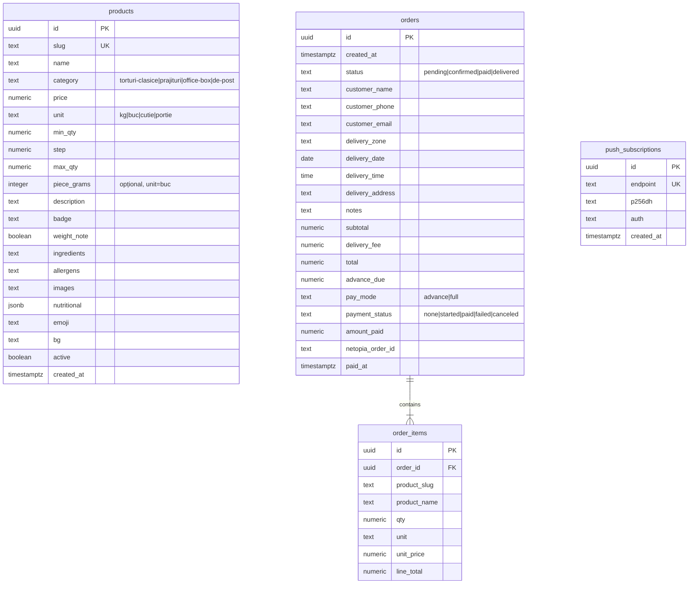
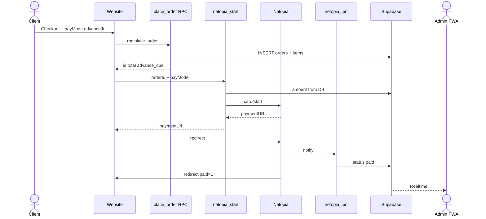

# 📐 Arhitectura Sistemului: BioCake

> [!abstract] Concept Tehnologic
> Frontend **static** (HTML + Vanilla JS + CSS premium) pe **Netlify**, backend **Supabase** (PostgreSQL, Auth, Realtime, Storage, Edge Functions). Fără VPS custom. Comenzile se plasează prin RPC **`place_order`** (preț server + tranzacție atomică).

---

## 1. Stiva Tehnologică (Stack)

| Strat | Tehnologie | Note |
| :--- | :--- | :--- |
| **Frontend** | HTML + Vanilla JS | Fără bundler în producție (deocamdată) |
| **Styling** | Vanilla CSS | Design tokens: vanilla / rose `#FC6D9F` / chocolate / gold; fonts non-blocking din `index.html` |
| **Backend / DB** | Supabase PostgreSQL | RLS + RPC |
| **Realtime** | Supabase Realtime | Comenzi noi în admin |
| **Găzduire** | Netlify | `https://biocake.ro` ← GitHub `main` |
| **PWA / Push** | SW + Web Push (VAPID) | Admin instalabil |
| **Plăți** | Netopia Payments API v2 | Hosted page; EF `netopia-start` + `netopia-ipn`; 50% sau 100% |

---

## 2. Modelul Bazei de Date

### Securitate date
*   Public: `SELECT` produse `active = true`
*   Public: **nu** INSERT direct pe orders — doar `place_order(…)` (SECURITY DEFINER)
*   Admin: `is_admin()` pe email JWT `admin@biocake.ro`
*   Orders UPDATE: grant doar pe coloana `status`

---

## 3. Disponibilitate produse (implementat vs planificat)

**Implementat:** flag `active` (toggle în admin) — produs inactiv dispare din catalog public.

**Planificat (neimplementat):** stoc numeric, limită zilnică producție, calendar blocare zile.

---

## 4. Fluxul unei Comenzi

---

## 5. Panoul de Administrare

**Status: ✅ IMPLEMENTAT** (+ PWA, push, P0 security, CRUD imagini, status plată Netopia).

* Auth persist (`biocake-auth`)
* Comenzi: realtime, filtre, status, delete, WhatsApp, afișare `payment_status` / `pay_mode`
* Produse: CRUD, Storage upload, reorder, `piece_grams`, greutăți kg
* PWA: `sw.js`, manifest, iconițe

### Planificat
* Calendar / layout admin 2-col pe desktop
* Link plată Netopia pentru comenzi custom
---

## 6. Fișiere JS publice (ordine load)

`config.js` → `supabase.js` → `data.js` → `cart.js` → `catalog.js` → `cart-ui.js` → `orders.js` → `checkout.js` → `app.js`

---

*Ultima actualizare: 2026-07-19*
