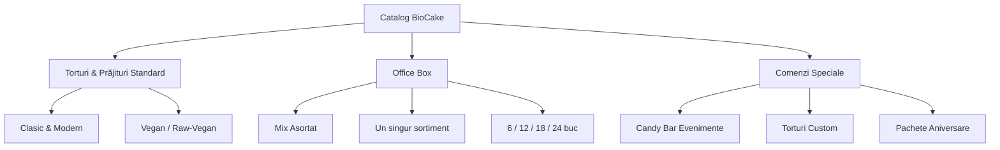

# 📊 Plan de Afaceri: BioCake

> [!abstract] Sinteză
> BioCake este o cofetărie online premium din București, specializată în deserturi artizanale clasice, tradiționale și moderne de înaltă calitate, integrând în catalog și opțiuni vegane/raw-vegane. Afacerea valorifică experiența de o viață a fondatoarei ca pastry chef și colaborarea existentă cu restaurantul vegan "Sublimmme". Modelul operațional este exclusiv digital, bazat pe **livrare la domiciliu/birou** în București, fără punct de ridicare fizic, optimizând astfel costurile fixe.

---

## 1. Misiune și Valori

- **Misiune**: Să aducem bucuria deserturilor artizanale premium (clasice, moderne și tradiționale) de înaltă calitate direct la ușa clienților, oferind rețete rafinate realizate exclusiv din ingrediente naturale.
- **Valori**:
  - **Calitate Fără Compromis**: Utilizarea de ingrediente naturale, proaspete și premium, fără premixuri industriale, coloranți artificiali sau conservanți.
  - **Tradiție & Rafinament Modern**: Îmbinarea tehnicilor clasice, consacrate de cofetărie cu rețete inovatoare de patiserie modernă.
  - **Diversitate & Incluziune**: Integrarea de opțiuni vegane, raw-vegane și fără gluten în portofoliu, fără ca acestea să definească în exclusivitate brandul.

---

## 2. Analiza Pieței (București)

### Segmentul de Clienți 🎯
1. **Iubitorii de Deserturi Premium**: Persoane care caută prăjituri clasice, tradiționale (de ex. cozonaci artizanali, tarte) și moderne (de ex. mousse-uri, entremets) realizate la standarde înalte de calitate.
2. **Organizatorii de Evenimente & Familiile**: Clienți care comandă torturi personalizate pentru zile de naștere, nunți, botezuri și candy bar-uri.
3. **Consumatorii cu Preferințe/Restricții Alimentare**: Persoane care caută deserturi vegane, raw-vegane sau fără lactoză/gluten din considerente medicale sau de stil de viață.
4. **Corporates / B2B**: Companii din București care comandă *Office Boxes* pentru aniversări interne sau evenimente corporate.

### Concurența ⚖️
- **Cofetării clasice**: Gamă largă de produse, dar folosesc frecvent ingrediente semipreparate sau aditivi pentru extinderea valabilității.
- **Branduri vegane/bio existente**: Focus exclusiv pe sănătos/vegan, adesea în detrimentul gamei tradiționale sau cu o estetică limitată.
- **Diferențiatorul BioCake**:
  - Calitatea de cofetărie artizanală condusă de un pastry chef cu zeci de ani de experiență în cofetăria tradițională și modernă.
  - Capacitatea de a livra atât gustul nostalgic clasic, cât și alternative moderne (inclusiv vegan/raw-vegan testate prin colaborarea cu Sublimmme).
  - Model exclusiv de livrare, permițând prețuri competitive datorită lipsei costurilor de chirie pentru spațiu comercial stradal.

---

## 3. Portofoliul de Produse

### 3.1. Torturi & Prăjituri Standard
* **Torturi Clasice & Moderne**: Tort Fraisier, Tort Ciocolată Belgiană, Tort Caramel & Nucă, Tort Red Velvet.
* **Torturi Vegan / Raw Vegan**: Tort Ciocolată Raw (cacao raw, avocado, caju, curmale), Tort Fructe Pădure Raw.
* **Prăjituri la bucată**: Tartă cu Fructe de sezon, Brownie Ciocolată Belgiană cu nuci pecane, Mini Ecler Vanilie, Cheesecake Fructe Pădure.

### 3.2. Office Boxes (Pachete pentru Birou)
* Casetă cu mini-prăjituri artizanale inspirată de tradiția românească de a împărți dulciuri la birou de ziua ta. Disponibilă în **4 mărimi**: **6 / 12 / 18 / 24 bucăți**.
* **Tipuri de cutie**:
  - **Mix Asortat**: selecție variată de mini-prăjituri cu arome diferite (brownie ciocolată, cheesecake fructe de pădure, tarte cu lămâie, mini ecler cu vanilie etc.)
  - **Un Singur Sortiment**: clientul alege un singur tip, disponibil în funcție de sezon.
* Prețuri orientative: ~90 RON (6 buc) · ~165 RON (12 buc) · ~240 RON (18 buc) · ~300 RON (24 buc).

### 3.3. Comenzi Speciale (Candy Bar & Custom)
* **Torturi Personalizate**: Machete decorative, torturi tematice pentru copii sau nunți/botezuri.
* **Candy Bar**: Servicii de aranjare și livrare a standurilor de deserturi pentru evenimente private în București.
* **Pachet Aniversar**: Tort + prăjituri asortate + surprize dulci, complet la comandă.
* **Modalitate Plată**: Clientul trimite detaliile comenzii, primește o ofertă personalizată. **Pentru toate comenzile speciale se percepe un avans de 50%.**

---

## 4. Modelul Operațional & Logistica

### 4.1. Laboratorul de Producție 🍳
* Firma funcționează legal și are deja capacitatea de producție asigurată pentru colaborarea cu restaurantul "Sublimmme".
* Capacitatea de producție va fi extinsă treptat în funcție de comenzile online.

### 4.2. Fluxul de Comandă online 💻
1. **Plasare**: Clientul alege produsele pe site.
2. **Selecție Dată/Oră**: Toate comenzile necesită o programare cu **minimum 48 de ore în avans** pentru preparare și decorare.
3. **Plată (Avans 50% sau Integral 100%)**: Integrare cu **Netopia Payments** pentru plăți securizate online. Clientul poate opta pentru achitarea unui avans de 50% (restul de 50% fiind plătit cash/card la curier) sau pentru plata integrală (100%). Se prezintă o notificare discretă prin care clientul ia la cunoștință că, fiind produse artizanale lucrate manual, greutatea finală poate înregistra o marjă de eroare de sub 100 de grame.
4. **Alocare Stoc**: Produsele sunt scăzute automat din stocul zilnic pentru a preveni supra-comanda.

### 4.3. Livrarea & Tarife (București & Ilfov) 🚗
* **Fără ridicare personală**: Pentru a simplifica logistica laboratorului, toate produsele sunt distribuite exclusiv prin livrare la adresa clientului.
* **Structură Tarife Livrare**:
  - **București**: Tarif fix de **20 RON** per livrare. Transport **gratuit** pentru comenzi care depășesc **250 RON**.
  - **Ilfov**: Tarif fix de **40 RON** per livrare. Transport **gratuit** pentru comenzi care depășesc **600 RON**.
* **Logistica livrării**:
  - *Faza I*: Livrare proprie cu mașină frigorifică dedicată (pentru a asigura integritatea torturilor complexe).
  - *Faza II*: Integrare API cu servicii de curierat rapid specializat pe produse proaspete/sensibile (ex: BeeFast, Bolt Business, Glovo Custom).

---

## 5. Strategia de Marketing și Promovare

* **Promovare Încrucișată (Cross-Promotion)**: Flyere și branding plasate în restaurantul *Sublimmme* pentru a direcționa clienții fideli ai restaurantului către magazinul online BioCake.
* **Social Media (Visual Storytelling)**: Accent pe procesul de producție (reels cu mama preparând torturile), evidențiind calitatea ingredientelor naturale și expertiza de pastry chef.
* **Google Local & SEO**: Optimizare SEO pe termeni precum „tort vegan Bucuresti”, „prajituri raw vegane livrare”, „office box Bucuresti”.
